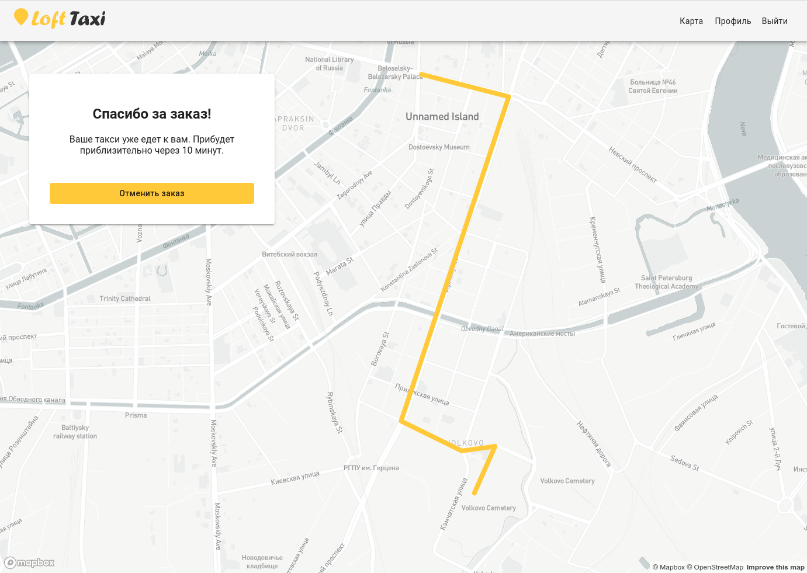

## Учебное приложение по заказу такси

Это учебное приложение, разработанное на курсе React от LoftSchool  

## Старт проекта:

Склонируйте репозиторий:

### `git clone https://github.com/nbuk/loft-taxi.git`

Установите записимиости:

### `npm install`

Для запуска:

### `npm start`

Приложение будет доступно по адресу: [http://localhost:3000](http://localhost:3000).

## Используемые технологии

* React
* Redux
* Material UI
* Mapbox
* Redux-saga
* react-router-dom
* react-final-form
* Jest
